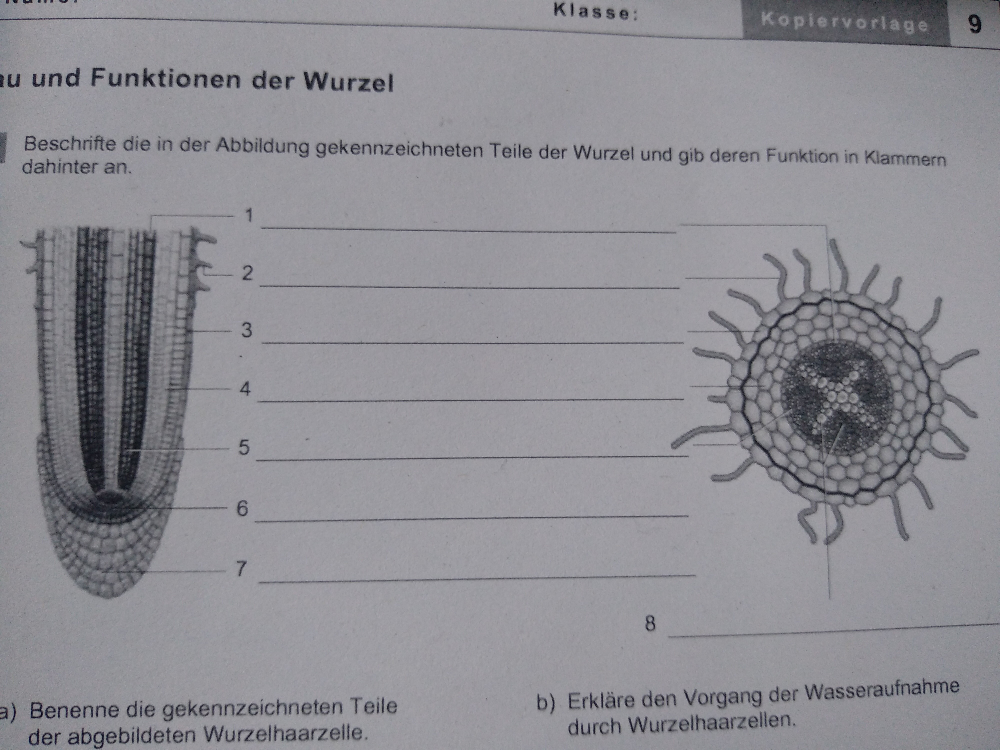

Verbreitung von Früchten und Samen:

- durch Wasser:
    - Kokosnuss
- durch Selbstverbreitung:
    - Springkraut
- durch Wind:
    - Löwenzahn
    - Ahornsamen
    - Mohn
- durch Tiere:
    - Vogelbeere (Lockfrüchte)
    - Klette (Klettfrüchte)
- durch Fallvorrichtungen:
    - Kastanie

## Die Wurzel

### Bau und Funktionen der Wurzel

]
1. Endodermis (Regulation der Wasseraufnahme)
2. Wurzelhaar (Wasser-, Nährsalzaufnahme)
3. Rhizodermis (Schutz der inneren Wurzelteile)
4. Rinde (Schutz, Stoffspeicherung)
5. Zentralzylinder (Ort der Siebzellen und Gefäße -> Wasser-, Stofftransport)
6. Bildungsgewebe (Bildung neuer Zellen)
7. Wurzelhaube (Schutz der Wurzelspitze; Erhöhung der Gleitfähigkeit zum Vordringen in den Boden)
8. Leitbündel (Wasser-, Stofftransport)

### Wurzelsysteme

- Flachwurzler
  - z.B. Fichte, Pappel, Kartoffel, Gräser
- Tiefwurzler
  - z.B. Eiche, Tanne, Kiefer, Löwenzahn
- Sprossbürtige Wurzelsysteme
  - z.B. Getreide, Farne, Maiglöckchen, Gräser 

### Wurzelmetamorphosen

### Wasseraufnahme durch die Wurzeln

#### Physikalische Grundlagen
Diffusion:
- physikalischer Prozess, der zur gleichmäßigen Verteilung der Teilchen im Raum führt
- Ursache: thermische Eigenbewegung der Teilchen -> Brown'sche Molekularbewegung
- Konzentrationsausgleich wird angestrebt -> d.h. Teilchen bewegen sich vom Ort der höheren zum Ort der niedrigeren Konzentration
- Diffusionsgeschwindigkeit abhängig von
  - Größe der Teilchen
  - Temperatur
  - Konzentrationsgefälle
  - Grenzfläche, durch die der Stoff diffundiert
  - Diffusionsstrecke

Osmose:
- die Diffusion von Flüssigkeiten durch eine selektiv permeable Membran

#### Ort der Wasseraufnahme

Wurzelhaarzellen -> vergrößern die Wurzeloberfläche (bis auf das 12-fache)

sehr kurzlebig (wenige Tage) -> Wurzel muss immer wachsen, um Wasser aufnehmen zu können.

Bau einer Wurzelhaarzelle:

