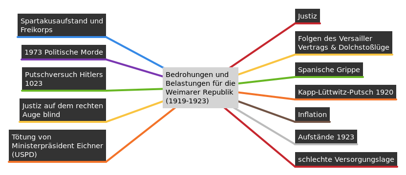

# Geschichte

## Warum folgten so viele Menschen den Bolschewiki?

### Gründe (Q5, D1&Q7, Q9)
- Schürten massiv Ängste unter der Bevölkerung
- Aufhetzen der Bevölkerung gegeneinander ("Denunziation")

## 1.3 Novemberrevolution in GER (1914/...) - ein Neuanfang für Deutschland?

- Regierung und Parlament schlossen im Zuge der Kriegserklärung Burgfrieden (= Niederlegung parteilicher Auseinandersetzungen und Bewilligung der Militärausgaben bis Kriegsende=)
- Kampfeswille der Deutschen litt schnell unter der festgefahrenen Frontsituation und der schlechten Versorgungslage.
- April 1917: USPD gründete sich nach Spaltung der SPD → forderten Kriegsende und Ende der Monarchie.
- Bildung des interfraktionellen Ausschusses (Zentrum, MSPD, Freisinnige, Nationalliberale)\ → forderten Frieden ohne Eroberung im Reichstag (= Friedensresolution)
- → hatte keinen Einfluss auf Kriegsverlauf, entfachte aber Debatte um Friedensschluss\ (Verständigungsfrieden vs. Siegfrieden)
- Proteste im Januar 1918 nicht erfolgreich (Anlass waren die 14-Punkte von Wilson)
- Ende des Krieges im August 1918 absehbar → Zweifel auch bei der Obersten Heeresleitung
- OHL wollte Frieden und leitete demokratische Verfassungsreform ein → liberaler Prinz
  Max von Baden wurde durch Kaiser zum neuen RK ernannt
- Reichskanzler berief Abgeordnete der MSPD, des Zentrums und der fortschrittlichen Volkspartei zur ersten parlamentarischen Regierung ein (= parlamentarische Monarchie wird gefestigt)
- Schwierige Versorgungslage spitzte sich weiter zu → Hungeraufstände
- 29/10/1918: die seit 1916 nicht mehr eingesetzte Flotte verweigert das sinnlose Auslaufen und meutert (= Kieler Matrosenaufstand)
- Solidarisierungskampagnen in ganz Dtl. breiteten sich wie ein Lauffeuer aus
- Überlaufen oder Kapitulation des Militär- und Polizeiapparates führen zu einer ungehinderten Ausbreitung der Revolution.
  - Vertreibung und Abdankung der Fürsten → Machtübernahme durch die Arbeiter- und Soldatenräte.

> Die Revolutionären Ereignisse im November 1918 \
> Zentren: \
> Ruhrgebiet, Sachsen, Norddeutschland (Industriegebiete, Hafenstädte) \
> Träger der Revolution: \
> Arbeiter, Soldaten, Matrosen

- **09/10/1918** = Revolution erreicht Berlin → Überschlagen der Ereignisse
  - zur Beruhigung der Mass verkündet Max von Baden eigenmächtig das Abdanken des Kaisers und gibt die Reichsverantwortung ab
  - Friedrich Ebert zögert mit Übernahme, da er sie für verfassungswidrig hält, → legt Skrupel aber beiseite, da er den Einfluss über die aufgewiegelten Massen nicht verlieren will
  - Unter dem Druck der Straße ruft Philipp Scheidemann gegen 14 Uhr die Republik vom Balkon des Reichstages aus.
  - Gegen 16 Uhr proklamiert Karl Liebknecht die sozialistische Republik.

**Die doppelte Ausrufung der Republik:**
- **Republik**
  - **Inhalt:** Ausruf der Republik, Bezeichnung der Monarchie als alt und morsch
  - **Ziele:** Aufbau einer deutschen Republik mit Reichskanzler, keine Gefährdung der neuen Ordnung
- **Sozialistische Republik**
  - **Inhalt:** Typische sozialistische Rhetorik, Aufruf zur Befreiung vom Kapitalismus
  - **Ziele:** Befreiung der Arbeiterschicht, Einführung des Sozialismus, Gleichsetzung Aller

**Parlamentarische Demokratie und Räterepublik**
parlamentarische Demokratie = Form der repräsentativen Demokratie. Vom Volk gewählte Parlamentarier üben die gesetzgebende Gewalt aus. Das Parlament kontrolliert die Regierung. Unabhängige Gericht wachen über Regierung und Parlament.
Räterepublik = For einer direkten Demokratie. Vom Volk gewählte Räte üben die Herrschaft aus. Sie sind an die Weisungen ihrer Wähler gebunden un ihnen rechenschaftspflichtig. Sie können jederzeit abberufen werden. Eine Gewaltenteilung gibt es nicht.

**10/11/1918 →**
- Flucht Wilhelm II. ins holländische Exil
- Bildung einer provisorischen Regierung aus SPD- und USPD-Mitgliedern ("Rat der Volksbeauftragten") unter Führung von **Friedrich Ebert** (SPD)
- Unterzeichnung des **Ebert-Groener-Bündnis** → um die Ordnung und Sicherheit zu gewährleisten sowie linksradikale Umsturzversuche zu verhindern, schloss die SPD mit dem Militär ein Abkommen, das den Schutz des Staates sicherstellte und gleichzeitig eine Einmischung der Politik in die Belange des Militärs verhindern sollte (→ führt zu Spaltung zwischen gemäßigten und radikalen Linken)
- 11.11.1918: Matthias Erzberger (Zentrum) muss als Vertreter der dt. Verhandlungskommission die polit. Verantwortung übernehmen und unterzeichnet den vorgelegten Waffenstillstandsvertrag der Entente-Staaten in Compiegne
- Gründung der „Zentralarbeitsgemeinschaft“ (auch Stinnes-Legien-Abkommen genannt) am 15/11/1918 beschlossen → Anerkennung der Gewerkschaften, 8h-Tag bei vollem Lohnausgleich, Sozialpartnerschaft zwischen Arbeitnehmern und Arbeitgebern
- Reichsrätekongress aller deutschen Räte vom 16.-20.12. („Radikale“ wie Liebknecht und Luxemburg ausgeschlossen) → Einigung auf Wahltermin zur Nationalversammlung und Ablehnung des Rätesystems (allerdings Demokratisierung vieler Bereiche wie Militär und Verwaltung gefordert)
- Austritt der USPD-Mitglieder aus dem Rat der Volksbeauftragten am 28.12.1918
- Gründung der KPD am 01.01.1919
- Hausbesetzungen und Ausrufung des Generalstreiks ab dem 05.01. → wurde im Auftrag der SPD-Regierung durch Freikorps (Bünde ehemaliger Frontsoldaten, unter Einfluss des Militärs) sehr blutig niedergeschlagen („Spartakusaufstand“)
- Trauriger Höhepunkt = Ermordung von Liebknecht und Luxemburg am 15.01.1919 durch Freikorpsoffiziere
- Wahl am 19.01. zeigte breites Parteienspektrum, stärkste Kraft wurde die SPD
- Eröffnung der Nationalversammlung am 06.02. in Weimar: Reichspräsident wurde Ebert, Scheidemann verantwortlich für die Regierungsbildung, „Weimarer Koalition“ aus SPD, Z und DDP stellte Regierung → Weimar wurde als Ort ausgewählt, da Berlin zu unsicher war
- Verbliebene Räte machten offen Front gegen die neue Regierung → es kam zu einem Bürgerkrieg zwischen Februar und Mai 1919 mit vielen Toten

### SPD

Ausrichtung:
- gemäßigt links

Ziele:
- Schutz der Demokratie vor Umstürzen durch andere Parteien
- Stabilisiertes politisches System
- Sicherung der Verfassungsmäßigen Grundrechte

Wählerschaft & Milieu:
- Arbeiter / Akademiker

Haltung zur Republik:
- akzeptiert die Republik als einzig sinnvolle Regierungsform

Politische Verbündete
- (USPD)

## 2.2 Die Krisenjahre der Weimarer Republik

