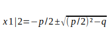

# Mathematik
## Berechnung des Schnittpunktes zweier linearer Funktionen

Taxiunternehmen A verlangt eine Grundgebühr von 3 € und 50 ct pro km.
Taxiunternehmen B verlangt eine Grundgebühr von 2,50 € und 60 ct pro km.

f(x)=3+x*0.5

g(x)=x*0.6+2.5

## Lösungsverfahren für Lösungsverfahren
### Das Gleichsetzungsverfahren

1. Stelle beide Gleichungen nach einer Variabel um
2. Setze I = II
3. Gleichung Lösen

I: 600=6j-3m
II: 1000=m+j

I:t+b=28

II:4t+2b=92

I:t+b=28 | -b

  t=28-b

II:4*(28-b)+2b=92

  112-4b+2b=92

  112-2b=92|-112

  -2b=-20  |:(-2)

  b=10

  t=28-10

  t=18

### Das Einsetzungsverfahren

### Das Additionsverfahren

1. 2x + 7y = 20 | * (-2)
2. 4x + 4y = 15

1. -4x - 14y = -40
2. 4x + 4y = 15

1 + 2) -4x + 4x - 14y + 4y = -40 + 15

##### Übung

I) 4x-5y=8 | *(-4)
II) 16x+5b=-4

I) -16x-6y=8
II) 

## 2. Drogen sind Gesund

### 2.2 Irrationale Zahlen

Die Quadratwurzel einer nicht negativen Zahl y ist diejenige nichtnegative Zahl x, für die gilt:
- x²=y
- Notation x=√y

Aus der Def. folgt: √y*√y=y und (-√y*-√y)=y

Verallgemeinerung:
Die n-te Wurzel einer nichtnegativen Zahl y ist diejenige nichtnegative Zahl x, für die gilt: xn=y (n>=2;n∈N)

Notation: x=n√y

Bsp.:
1. 2√49=√49 \
=7
2. ³√1000=10
3. ⁴√81=3

**ACHTUNG!** Das Wurzelziehen (Radizieren) ist die Gegenoperation des Potenzierens.

LB.S.13/7;11

7
a) 10
b) 
c) 4
d) 0
e) 10
f) 0,1
g) 1/2
h) 5
i) 2/3
j) 1/3
k) 2
l) 0,1
m) 0,4
n) 0,3
o) 2

11
 6m
 3m²

### Rechnen mit Wurzeln

Aus der Def. der Wurzel folgt:
x=√x*√x

Aus den Potenzgesetzen folgt: 
x=x1/2*x1/2

=> x1/2=√x

analog:
`x=³√x*³√x*³√x`

x=x1/3*x1/3*x1/3

=> x1/3=√x

**Verallgemeinerung:**

a) 3
b) 2
c) 1/2
d) 125
e) 
f) 2
g) 1/5
h) 

am/n=...=n√am

Merke: Sämtliche Potenzgesetze gelten auch für gebrochene Exponenten.

z.B. √a*√b=a1/2*b1/2

### Irrationale und reelle Zahlen

#### Reelle Zahlen:
- Zahlenbereich aus Gebrochenen und Irrationalen Zahlen

#### Irrationale Zahlen
- Zahlen, welche unbegrenzt viele Nachkommastellen besitzen ohne periodisch zu sein.

Natürliche Zahlen (N) (0, 1023, 4)
Ganze Zahlen (Z) (alles in N + -3, -7, -1023)
Rationale Zahlen (Q) (alles in Z + 100/99, -4/3, 11/7, -1/7)
Reelle Zahlen (R) (alles in Q + √2, π, ℇ, 1,0102030405...)

| Die Zahl ist Element von: | -3   | 0,4  | 16/3 | 10-1 | 10³ | 2,03 | -(30/6) | -1²  | 0   | 0,123456... |
|---------------------------|------|------|------|-----------------|-----|------|---------|------|-----|-------------|
| N                         | nein | nein | nein | nein            | ja  | nein | nein    | nein | ja  | nein        |
| Z                         | ja   | nein | nein | nein            | ja  | nein | nein    | ja   | ja  | nein        |
| Q                         | ja   | ja   | ja   | ja              | ja  | ja   | ja      | ja   | ja  | nein        |
| R                         | ja   | ja   | ja   | ja              | ja  | ja   | ja      | ja   | ja  | ja          |

|                          | f(x)=2x-3                   | g(x)=x⁴           | h(x)=√x  |
|--------------------------|-----------------------------|-------------------|----------|
| Definitionsbereich       |                             |                   |          |
| Wertebereich             |                             |                   |          |
| Nullstellen              | 1,5; 0                      | 0; 0              | ?        |
| Schnittpunkt mit y-Achse | 0; -3                       | 0; 0              | 0; 0     |
| Symmetrie                | Achsensymmetrisch entlang y |                   |          |
| Extrema                  |                             |                   |          |
| Monotonie                | Steigend                    | Fallend bis (0;0) | Steigend |

### Potenzfunktionen

Funktionen des Typs f(x)=xr

| Wert               | r negativ, gerade                | r negativ, ungerade                      | r positiv, gerade | r positiv, ungerade |
|--------------------|----------------------------------|------------------------------------------|-------------------|---------------------|
| Beispiel           | f(x)=x⁴                          |                                          |                   |                     |
| Definitionsbereich | x ∈ R; x≠0                       | x ∈ R; x≠0                               | x ∈ R             |                     |
| Wertebereich       | y ∈ R; y>0                       | y ∈ R; y≠0                               | y ∈ R; y⪭0        |                     |
| Nullstellen        | keine                            | keine                                    |                   |                     |
| Schnittpunkt mit y | keine                            | keine                                    |                   |                     |
| Extrema            | Keine                            | keine                                    |                   |                     |
| Monotonie          | steigend bis x=0, fallend ab x=0 | fallend                                  |                   |                     |
| Symmetrie          | Achsensymmetrisch entlang y      | punktsymmetrisch zum Koordinatenursprung |                   |                     |

(r≠1)
(r≠0)

Mathe KA 21/03/2023 Themen Potenzfunktionen & Quadratische Funktionen (Graphen Zeichnen, Rechnen & Merkmale, Scheitelpunktform)

## Nullstellenberechnung quadratischer Funktionen

Herleitung der p-q-Formel:

f(x) = x² + px + q

0 = x² + px + q | -q

0 - q = x² + px | +(p/2)²

-q + (p/2)² = x²  + px + (p/2)² | bin. Formel 1

-q + (p/2)² = (x + p/2)² | ±√

±√-q+(p/2)² = x1|2+p/2 | -p/2

**x1|2-p/2±√(p/2)²-q**

Bsp.:  

f(x) = x² + 8x - 7  (p=8,q=7)

x1|2 = -p/2 ±√(p/2)² - (-q)

x1|2 = -8/2 ±√(8/2)² - (-7)

x1|2 = -4 ±√16+7

x1|2 = -4 ±√23

x1 = -4 + √23

x2 = -4 - √23

## Lösen quadratischer Gleichungen

**Hinweis: Umformen zu 0=**

